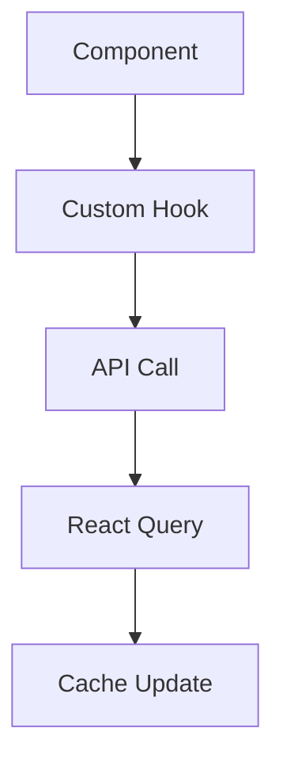

# Exploration Documentation

## Description

A methodology for creating comprehensive, searchable documentation from codebase exploration findings. This skill transforms exploration data into various formats for different audiences.

## When to Use

- After completing `/how [feature]` exploration
- Creating project documentation for onboarding
- Generating architecture decision records (ADRs)
- Building knowledge bases and wikis
- Creating handoff documentation

## Documentation Types

### 1. Quick Reference Cards

**Purpose**: Rapid understanding for developers already familiar with the codebase

**Template**:
```markdown
# [Feature] - Quick Reference

## Location
```
src/features/[feature]/
├── components/
├── hooks/
├── api/
└── types/
```

## Key Files
- **Main**: `index.tsx` - Entry point
- **API**: `api/[feature].ts` - Endpoints
- **Types**: `types/[feature].ts` - Interfaces

## Patterns Used
- **State**: React Query + useState
- **Form**: react-hook-form + Zod
- **Auth**: Protected routes

## Critical Functions
- `calculateTotal()` - Line 45-89
- `validateUser()` - Line 120-145

## Gotchas
- Tax rates are region-specific (DO NOT CHANGE)
- Cache invalidation required after updates
```

### 2. Developer Onboarding Guide

**Purpose**: Complete understanding for new team members

**Template**:
```markdown
# [Feature] - Developer Guide

## Overview
[Brief description of what this feature does and why it exists]

## How It Works
### User Flow
1. User visits /[feature]
2. Data loads via API
3. User interacts
4. Changes saved

### Technical Flow


## Architecture
### Design Pattern
- **Pattern**: Container/Presentational
- **Rationale**: Separation of concerns, testability

### State Management
| Type | Solution | Files |
|------|----------|-------|
| Server | React Query | `hooks/use*.ts` |
| Form | react-hook-form | `components/*.tsx` |
| UI | useState | Component files |

## Key Components

### FeatureContainer
- **Purpose**: Main logic container
- **State**: Manages feature state
- **API**: Handles all API calls

### FeatureForm
- **Purpose**: User input form
- **Validation**: Zod schema
- **Submission**: Optimistic updates

## Making Changes

### Adding a New Field
1. Update `types/feature.ts`
2. Add to Zod schema in `schemas/`
3. Update form component
4. Add to API payload
5. Update database model if needed

### Common Tasks
- **Add validation**: Edit schema in `schemas/`
- **Change API**: Update `api/feature.ts`
- **Update styles**: Modify component classes

## Testing
- **Unit**: `__tests__/unit/`
- **Integration**: `__tests__/integration/`
- **E2E**: `__tests__/e2e/`

## Dependencies
- **Critical**: react-query, zod, react-hook-form
- **Optional**: @tanstack/react-query-devtools
```

### 3. Architecture Decision Records (ADRs)

**Purpose**: Documenting important architectural decisions

**Template**:
```markdown
# ADR-[number]: [Decision Title]

## Status
Accepted / Superseded / Deprecated

## Context
[What situation led to this decision?]

## Decision
[What was decided?]

## Consequences
- **Positive**: Benefits gained
- **Negative**: Drawbacks introduced
- **Risks**: Potential issues

## Alternatives Considered
1. [Alternative 1]
   - Pros: ...
   - Cons: ...
2. [Alternative 2]
   - Pros: ...
   - Cons: ...

## Implementation
[How was it implemented? Code references]

## References
- Links to relevant docs
- Related files
```

### 4. API Documentation

**Purpose**: Clear API reference for integration

**Template**:
```markdown
# [Feature] API Reference

## Base URL
`/api/[feature]`

## Authentication
Required: Yes / No
Method: Bearer Token / Session

## Endpoints

### GET /[feature]
Retrieve list of items

**Parameters**:
| Name | Type | Required | Description |
|------|------|----------|-------------|
| page | number | No | Page number (default: 1) |
| limit | number | No | Items per page (default: 20) |
| filter | string | No | Filter criteria |

**Response**:
```json
{
  "data": [...],
  "pagination": {
    "page": 1,
    "total": 100
  }
}
```

### POST /[feature]
Create new item

**Body**:
```json
{
  "name": "string",
  "value": "number"
}
```

**Response**:
```json
{
  "id": "string",
  "createdAt": "ISO8601"
}
```

## Error Responses
All errors return:
```json
{
  "error": {
    "code": "ERROR_CODE",
    "message": "Human readable message"
  }
}
```

## Rate Limits
- 100 requests per minute per user
- Burst: 10 requests per second

## SDK Usage
```typescript
import { featureApi } from '@/lib/api';

const items = await featureApi.list({ page: 1, limit: 10 });
const item = await featureApi.create({ name: 'test' });
```
```

## Documentation Generation Workflow

### 1. Collect Exploration Data

From Phase 1 and Phase 2 exploration:
- File inventory
- Architecture patterns
- Business logic
- Security findings

### 2. Choose Documentation Type

Based on audience:
- **Quick Reference**: Experienced devs
- **Developer Guide**: New team members
- **API Docs**: External integrators
- **ADRs**: Architecture decisions

### 3. Generate Draft

Use exploration data to populate template:
1. Copy relevant sections
2. Add code examples
3. Create diagrams
4. Add cross-references

### 4. Review and Refine

- Validate accuracy
- Check completeness
- Add examples
- Improve clarity

### 5. Publish

- Save to appropriate location
- Update index/references
- Notify team
- Schedule reviews

## Best Practices

### Code Examples

Always include working code:
```typescript
// Good: Complete, working example
const result = await calculatePrice(items, {
  region: 'CA',
  coupon: 'SAVE10'
});

// Bad: Incomplete snippet
const result = calculatePrice(items);
```

### Cross-References

Link between documentation:
- API docs link to implementation
- Guides link to API docs
- ADRs reference code

### Versioning

- Document version compatibility
- Note breaking changes
- Keep older versions accessible

### Maintenance

- Review quarterly
- Update with code changes
- Remove outdated information
- Add new patterns as discovered

## Automation Opportunities

### 1. Auto-Generate API Docs

From OpenAPI/Swagger specs:
```bash
# Generate from schema
npx swagger-markdown -i api/schema.yaml -o docs/api/
```

### 2. Diagram Generation

From code structure:
```typescript
// Tool to generate Mermaid diagrams
function generateDependencyGraph(files) {
  // Analyze imports
  // Create graph definition
  // Output Mermaid syntax
}
```

### 3. Type Documentation

From TypeScript definitions:
```bash
# Generate docs from .d.ts files
npx typedoc src/types/
```

## Integration with Commands

This skill enhances:
- `/how [feature]` - Auto-generates documentation
- `/doc [target]` - Creates specific doc types
- `/ship [feature]` - Includes docs in PRs